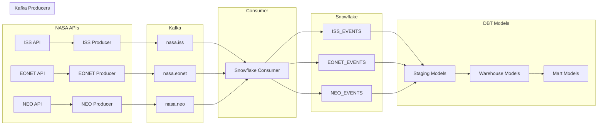

# NASA Analytics Hub

A real-time data pipeline that collects, processes, and analyzes data from various NASA APIs, including ISS location, Earth events (EONET), and Near Earth Objects (NEO).

## Architecture

## Data Flow

1. **Data Collection (Producers)**
   - ISS Producer: Fetches ISS location every 30 seconds
   - EONET Producer: Collects Earth events (wildfires, storms, etc.)
   - NEO Producer: Gathers Near Earth Object data

2. **Data Transport (Kafka)**
   - Three topics: nasa.iss, nasa.eonet, nasa.neo
   - Ensures reliable message delivery
   - Handles backpressure and scalability

3. **Data Storage (Snowflake)**
   - Raw data stored in variant columns
   - Separate tables for each data type
   - Maintains data lineage

4. **Data Transformation (DBT)**
   - Staging: Clean and type-cast raw data
   - Warehouse: Join and enrich data
   - Marts: Business-specific analytics

## Analytics Models

1. **Staging Models**
   - `stg_iss_events`: Clean ISS position data
   - `stg_eonet_events`: Parsed Earth events
   - `stg_neo_events`: Structured NEO data

2. **Warehouse Models**
   - `fact_eonet_events`: Detailed event analysis
   - `fact_iss_neo_proximity`: ISS and NEO correlations

3. **Mart Models**
   - `event_analysis`: Event patterns and trends
   - `hazard_analysis`: Combined Earth and space hazards
   - `iss_trajectory`: ISS movement analysis

## Data Quality

- Tests for critical fields (coordinates, IDs)
- Range validations for latitude/longitude
- Null checks for required fields
- Data freshness monitoring

## Monitoring

- Kafka topic lag monitoring
- Consumer group health checks
- Data pipeline latency tracking
- Error rate monitoring

## Future Enhancements

1. Add real-time alerting for:
   - Hazardous NEOs near ISS
   - Severe Earth events
   - Data pipeline issues

2. Implement:
   - Machine learning for event prediction
   - Automated reporting
   - API for data access
