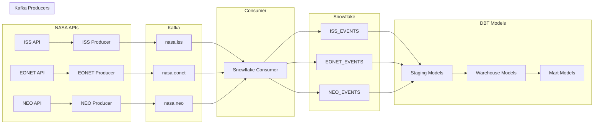

# NASA Analytics Hub

A real-time data pipeline that collects, processes, and analyzes data from various NASA APIs, including ISS location, Earth events (EONET), and Near Earth Objects (NEO).

## Architecture

## Project Components

### 1. Data Collection (Kafka Producers)
- **ISS Producer** (`Kafka/producers/iss_producer.py`)
  - Fetches ISS location every 30 seconds
  - Tracks position, velocity, and orbital parameters
  
- **EONET Producer**
  - Collects Earth events (wildfires, storms, etc.)
  - Includes event categories, geometries, and sources
  
- **NEO Producer**
  - Gathers Near Earth Object data
  - Tracks potentially hazardous asteroids

### 2. Data Processing (DBT)

#### Staging Models
- `stg_iss_events`: Clean ISS position data
  - Position (lat/long)
  - Timestamp
  - Message data
  
- `stg_eonet_events`: Parsed Earth events
  - Event details
  - Categories
  - Geometries
  
- `stg_neo_events`: Structured NEO data
  - Object properties
  - Hazard assessment
  - Approach data

#### Warehouse Models
- `fact_eonet_events`: Detailed event analysis
  - Event categorization
  - Geographic data
  - Time series analysis
  
- `fact_iss_neo_proximity`: ISS and NEO correlations
  - Proximity calculations
  - Risk assessment
  - Trajectory analysis

#### Mart Models
- `event_analysis`: Event patterns and trends
- `hazard_analysis`: Combined Earth and space hazards
- `iss_trajectory`: ISS movement analysis
- `iss_keplerian_analysis`: Orbital mechanics analysis

### 3. Machine Learning Models

#### Event Classification (`ML/event_classification.ipynb`)
- Classifies Earth events by type
- Features:
  - Geographic location
  - Temporal patterns
  - Event characteristics
- Model metrics and validation

#### ISS Orbital Analysis (`ML/iss_orbital_analysis.ipynb`)
- Analyzes ISS orbital dynamics
- Kepler's laws verification
- Orbital stability assessment
- Trajectory prediction

## Documentation

- [Data Model](docs/data_model.md): Detailed data model documentation
- DBT documentation: Generated docs for data transformations
- Model documentation: ML model specifications and performance

