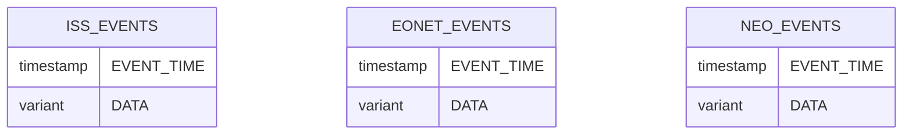
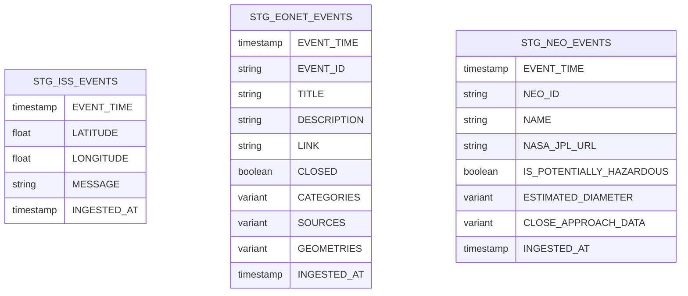
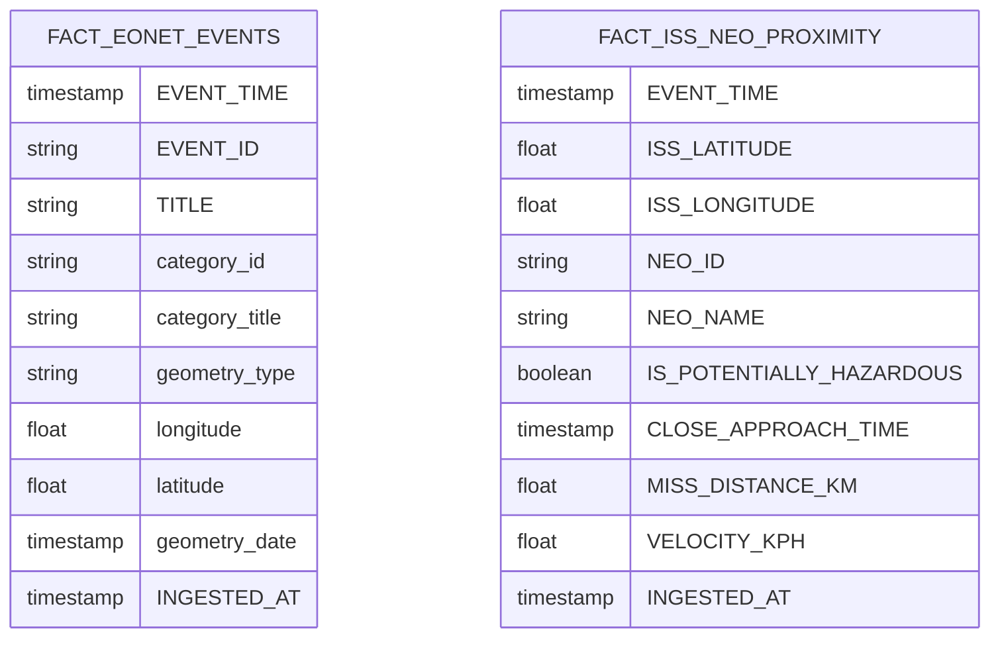
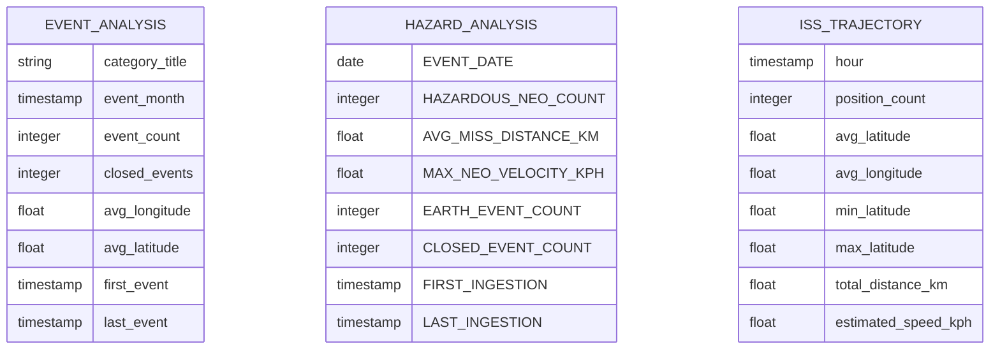
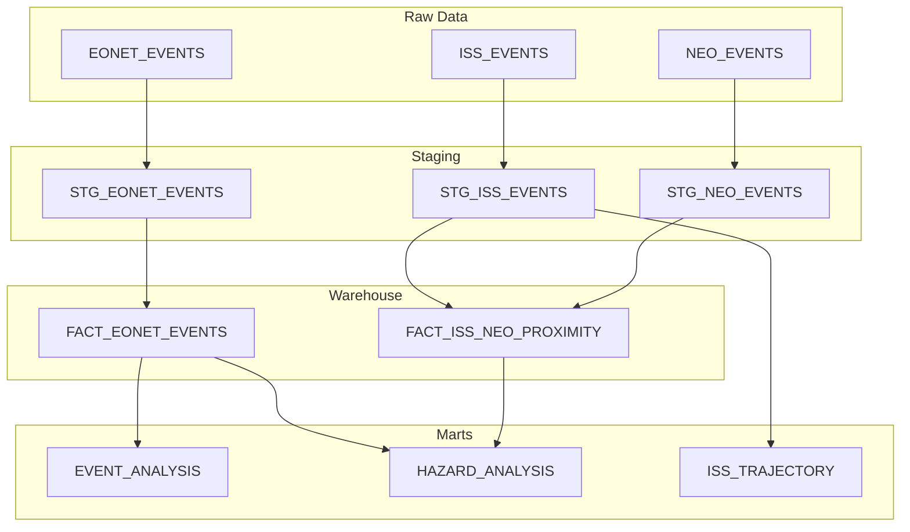

# NASA Analytics Hub - Data Model

## Raw Tables

```mermaid
erDiagram
    ISS_EVENTS {
        timestamp EVENT_TIME
        variant DATA
    }
    EONET_EVENTS {
        timestamp EVENT_TIME
        variant DATA
    }
    NEO_EVENTS {
        timestamp EVENT_TIME
        variant DATA
    }
```

## Staging Models

```mermaid
erDiagram
    STG_ISS_EVENTS {
        timestamp EVENT_TIME
        float LATITUDE
        float LONGITUDE
        string MESSAGE
        timestamp INGESTED_AT
    }
    STG_EONET_EVENTS {
        timestamp EVENT_TIME
        string EVENT_ID
        string TITLE
        string DESCRIPTION
        string LINK
        boolean CLOSED
        variant CATEGORIES
        variant SOURCES
        variant GEOMETRIES
        timestamp INGESTED_AT
    }
    STG_NEO_EVENTS {
        timestamp EVENT_TIME
        string NEO_ID
        string NAME
        string NASA_JPL_URL
        boolean IS_POTENTIALLY_HAZARDOUS
        variant ESTIMATED_DIAMETER
        variant CLOSE_APPROACH_DATA
        timestamp INGESTED_AT
    }
```

## Warehouse Models

```mermaid
erDiagram
    FACT_EONET_EVENTS {
        timestamp EVENT_TIME
        string EVENT_ID
        string TITLE
        string category_id
        string category_title
        string geometry_type
        float longitude
        float latitude
        timestamp geometry_date
        timestamp INGESTED_AT
    }
    FACT_ISS_NEO_PROXIMITY {
        timestamp EVENT_TIME
        float ISS_LATITUDE
        float ISS_LONGITUDE
        string NEO_ID
        string NEO_NAME
        boolean IS_POTENTIALLY_HAZARDOUS
        timestamp CLOSE_APPROACH_TIME
        float MISS_DISTANCE_KM
        float VELOCITY_KPH
        timestamp INGESTED_AT
    }
```

## Mart Models

```mermaid
erDiagram
    EVENT_ANALYSIS {
        string category_title
        timestamp event_month
        integer event_count
        integer closed_events
        float avg_longitude
        float avg_latitude
        timestamp first_event
        timestamp last_event
    }
    HAZARD_ANALYSIS {
        date EVENT_DATE
        integer HAZARDOUS_NEO_COUNT
        float AVG_MISS_DISTANCE_KM
        float MAX_NEO_VELOCITY_KPH
        integer EARTH_EVENT_COUNT
        integer CLOSED_EVENT_COUNT
        timestamp FIRST_INGESTION
        timestamp LAST_INGESTION
    }
    ISS_TRAJECTORY {
        timestamp hour
        integer position_count
        float avg_latitude
        float avg_longitude
        float min_latitude
        float max_latitude
        float total_distance_km
        float estimated_speed_kph
    }
```

## Data Relationships

```mermaid
graph TD
    subgraph Raw Data
        R1[ISS_EVENTS]
        R2[EONET_EVENTS]
        R3[NEO_EVENTS]
    end

    subgraph Staging
        S1[STG_ISS_EVENTS]
        S2[STG_EONET_EVENTS]
        S3[STG_NEO_EVENTS]
    end

    subgraph Warehouse
        W1[FACT_EONET_EVENTS]
        W2[FACT_ISS_NEO_PROXIMITY]
    end

    subgraph Marts
        M1[EVENT_ANALYSIS]
        M2[HAZARD_ANALYSIS]
        M3[ISS_TRAJECTORY]
    end

    R1 --> S1
    R2 --> S2
    R3 --> S3

    S2 --> W1
    S1 --> W2
    S3 --> W2

    W1 --> M1
    W1 --> M2
    W2 --> M2
    S1 --> M3
```
